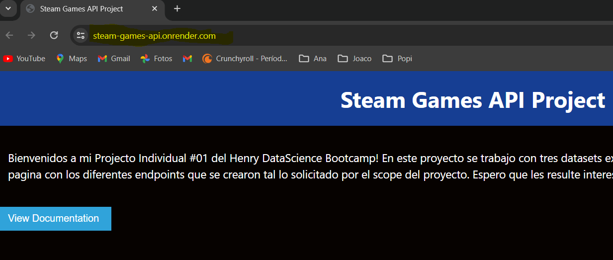

# Proyecto: Construcción de un Sistema de Recomendación de Juegos

### Resumen:

Recientemente completé mi primer proyecto individual durante mi bootcamp de Ciencia de Datos en SoyHenry. 
El proyecto involucró explorar tres conjuntos de datos completos de la plataforma de juegos Steam, para que luego de un exhaustivo proceso de ETL y EDA crear realizar un analisis de sentimiento sobre las recomendaciones de los usuarios, y con las bases de datos bien procesadas, crear, finalmente, un modelo de Recomendación y otras tantas funciones que luego se convertirían en endpoints de nuestra API deployada en Render 

### Pasos Realizados: 

## 1. Exploración y Limpieza de Datos: 

Mi viaje comenzó con un proceso ETL exhaustivo, donde realicé la limpieza de datos, validación y eliminación de duplicados. 
Comprender la información en cada conjunto de datos fue crucial, sentando las bases para un análisis más profundo. 
En esta etapa el primer desafío fue leer los archivos, cuestión que parecería trivial, pero que requirió de varias pruebas y error hasta lograrlo.  
El adicional de dificultad se presentó nuevamente, cuando al abrir los datos nos encontramos con listas de diccionarios anidadas 

#### Games:

La base de datos maestra de todos los juegos existentes en Steam presentó desafíos debido a su falta de información, muchas columnas incompletas. Esto me llevóa tener que decidir para cada dato su eliminación o imputación para no perder información.

#### Reviews:

El archivo reviews contiene todos los posteos de usuarios a los distintos juegos de la plataforma de Steam. Procesarla presentó sus desafíos debido a que los datos en la misma se encontraban, para cada usuario, en forma de una lista de diccionarios anidados 

#### Items:

Extraer información relevante de las estructuras JSON anidadas dentro de los perfiles de usuario fue también desafiante pero gratificante. Esto implicó iterar a través de los datos y expandirlos en columnas para construir un conjunto de datos útil para un análisis exhaustivo. 

Con el ETL finalizado continuamos con el proceso. 
Se pueden ver en detalle los procesos recorridos con las dataset proporcionados en:

[ETL_games](ETL_games.ipynb) 
[ETL_reviews](ETL_reviews.ipynb) 
[ETL_items](ETL_items.ipynb) 

## 2. Análisis de Sentimientos en Reseñas:

Centrándome en el marco de datos de reseñas, que contenía más de 55,000 reseñas de usuarios, realicé un análisis de sentimientos.  
Los métodos elegidos fueron: **NLTK y Textblob**. 
Procedí primero experimentando con NLTK ya que no era un método que hubieramos visto en detalle en clase. 
Pero al resultar muy costoso a nivel de recuros (tardaba 8 minutos en clasificar), decidí probar también con Textblob.
Aunque Textblob es un enfoque mucho más simple y proporciona un resultado bastante bueno, el enfoque NLTK ofreció una clasificación mucho mejor de las reseñas positivas y neutrales y las reseñas negativas también fueron identificadas de manera mucho más precisa. 
Además, el **enfoque NLTK** tiene una gama más amplia de características o variables para jugar y experimentar con el fin de mejorar el proceso de clasificación. 
Se pueden seguir y visualizar todos los pasos del desarrollo de estos dos métodos en [Feature Engineering](03.%20Feature%20Engineering.ipynb) en el primer detalle: 3.1 
Luego decidí comparar su rendimiento, considerando factores como la precisión de la clasificación y la eficiencia computacional.

### Puntuación del Análisis de Sentimientos:

Para evaluar los dos procesos de análisis de sentimientos que realicé decidí crear un **sistema de puntuación**. Esta puntuación se agregó al Dataframe reviews en una columna que nombré: **'rating'**  
La puntuación se definió con una fórmula que asignaba a la reseña una puntuación según: 

- La calificación que otros usuarios asignaron a la recomendación, si les resultó o no útil. 
- Si el usuario recomendó o no al juego a pesar de su reseña. (columna recommed)
- Sentiment resultante del analisis de Sentimiento realizado, positivo = 2 y negativo = 0.

Este scoring fue luego el corazdn de nuestro Sistema de Recomendación de Filtrado Colaborativo. 
Para ver en detalle como fue creada la función para el 'Rating' ver [Recommendation_Model](04.%20Recomendation_Model.ipynb)

### Conclusiones:

**Tomando los resultados de nuestra comparativa entre métodos, NLTK logró una puntuación del 81%, superando el 71% de Textblob, aunque con un tiempo computacional más largo.**

## 6. Análisis Exploratorio de Datos (EDA):

Durante el proceso de EDA pudimos ver para cada dataset, entre otros:

- el rango de las variables
- sus relaciones o independencia
- su valor como información y potencial
- un analisis de correlación para el precio y generos en games que resultó negativo.
  En fin, un trabajo muy valioso que se puede apreciar en detalle en:

[EDA_games](EDA_games.ipynb) 
[EDA_reviews](EDA_reviews.ipynb) 
[EDA_items](EDA_items.ipynb) 

El EDA proporcionó ideas sobre variables y sus relaciones, preparando el terreno para construir el núcleo del proyecto: **un modelo de aprendizaje automático para recomendación de juegos.**

## 7. Construcción del Sistema de Recomendación:

Para ambos modelos partimos de los datos de reviews de usuarios. 
Desarrollé dos métodos para la recomendación:

1. **Filtrado Colaborativo**
   En este método, se calcula la similitud entre los perfiles de los usuarios o entre los perfiles de los ítems utilizando la medida de similitud del coseno. Esta medida de similitud cuantifica la similitud entre las preferencias de los usuarios o las características de los ítems.
2. **Machine Learning similitud del coseno en combinación con KNN**: En este método, se emplea el algoritmo KNN para identificar los vecinos más cercanos y la similitud del coseno para encontrar las similitudes (score) entre los usuarios o ítems  
   Para ambas, creamos una función de busqueda por nombre de juego, ya que el input no es el id del juego sino su título. 
   El scoring para la similitud entre items y usuarios tiene como base los:

- user_id
- item_id
- rating (el desarrollado a partir de sentiment + recommender + helpful)

Para ambos modelos a su vez, se crean dos tipos de funciones:

- **item-item**:

  > **def find_similar_games**(game_name:str): cuando se ingresa el nombre del juego, tiene un motor de búsqueda que utiliza la similitud del coseno, el cual devuelve el juego con el nombre más similar al ingresado. Luego, de acuerdo con el Modelo de Filtrado Colaborativo, proporciona una lista de recomendaciones basadas en las puntuaciones y calificaciones de las reseñas de los usuarios, usuarios similares a aquellos que les gustó el juego ingresado.

- **usuario-item**
  > **def find_user_recommendations**(user_id:str): cuando se ingresa un ID de usuario, proporciona una lista de recomendaciones basadas en la matriz csr.item-usuario creada en el modelo de aprendizaje automático, utilizando KNN (K-Nearest Neighbors).

Los pasos detallados para la creación de cada modelo y sus funciones están documentados en [Modelo de Recomendación](04.%20Recomendation_Model.ipynb).

## 8. Funciones Destacadas Desarrolladas:

El desarrollo de todas las funciones que luego se visualizarán en Render se según lo solicitado en el scope del proyecto. 
Y se puede ver el paso a paso en el apartado [3.2 Feature Engineering](03.%20Feature%20Engineering.ipynb) 

1. **developer(developer:str)**: Renderiza una estructura JSON que muestra la historia de un desarrollador a lo largo de los años.
2. **user_data(user_id:str)**: Muestra el gasto del usuario, el porcentaje de juegos recomendados y el recuento total de juegos.
3. **UserForGenre(genre: str)**: Proporciona el usuario con las horas más altas jugadas para un género específico, categorizado por año.
4. **best_developer_year(year:int)**: Devuelve los 3 mejores desarrolladores recomendados por los usuarios para un año dado.
5. **developer_review_analysis(developer:str)**: Resume las reseñas positivas y negativas de un desarrollador.
6. **find_similar_games(game_name:str)**: Encuentra juegos similares basados en similitud coseno y proporciona recomendaciones.
7. **find_user_recommendations(user_id:str)**: Ofrece recomendaciones personalizadas basadas en interacciones entre usuarios y elementos.

# Implementación de FASTAPI y Render:

Comencé primero por aprender desde cero, ya que no tengo un background extenso en IT, que era una API. 
Cuando finalmente pude entender que es una API y como se utilizan, seguí con estudiar y entender el lenguaje que se utiliza para crear los endpoints, de decoradores, de respuesta JSONResponse, Query y pydantics varios.

Con todo este aprendizaje a cuestas, cree las funciones y sus endopoints en FASTAPI y pude hacer que todo corriera sin dificultades y sin erores en local. 
La alegría duró poco, en el primer intento de realizar el deploy en render comenzaron las fallas, la falta de espacio y tocó ir para atrás una y otra vez. 
Pero finalmente, despues de varias experimentaciones y revisión de las funciones para que leyeran df mas compactas y modificar los filtrados para que funcionaran de manera interactiva y asi evitar los merge o los datasets tan pesados, la API estuvo live por internet:

**Implementar la API en Render presentó desafíos significativos debido a la capacidad limitada de datos. Superar esto requirió solución de problemas creativos y extensos ensayos y errores. Sin embargo, la implementación exitosa sin errores o fallas fue inmensamente gratificante, culminando en un viaje de aprendizaje y crecimiento de una semana.**
